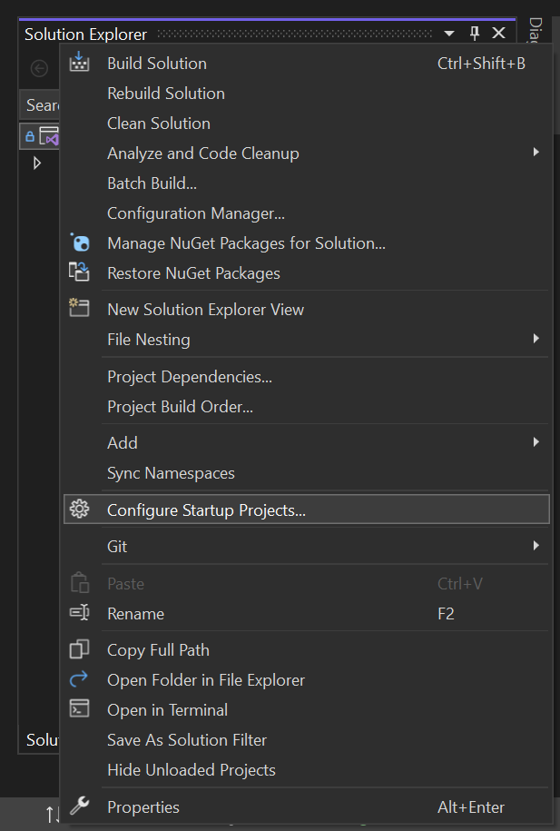
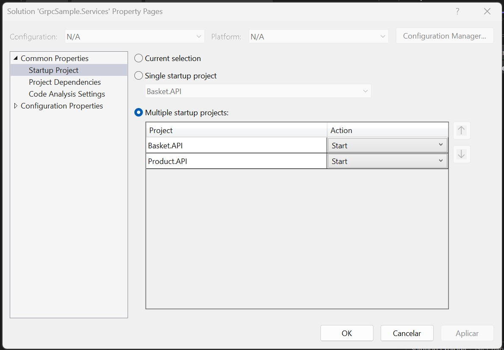

# Grpc sample
This is a simple project that implements [dotnet grpc](https://learn.microsoft.com/en-us/aspnet/core/grpc/?view=aspnetcore-7.0), basically we have two services: **Basket** and **Product**, inside the Basket service we have 3 features:
1. We can get all items that are inside a basket
2. We can add a new product inside a basket
3. We can remove a product from a basket

When adding a new product to a basket, to ensure that it is a valid product, a call is madei via gRPC from the Basket service to the Product service, simple as that.

# Running the project
It is necessary to start both services when running the project, for this you must:
1. Click on the solution with the right mouse button and select option `Configure Startup Projects...`

2. Set the `Action` of the two projects to `Start`

